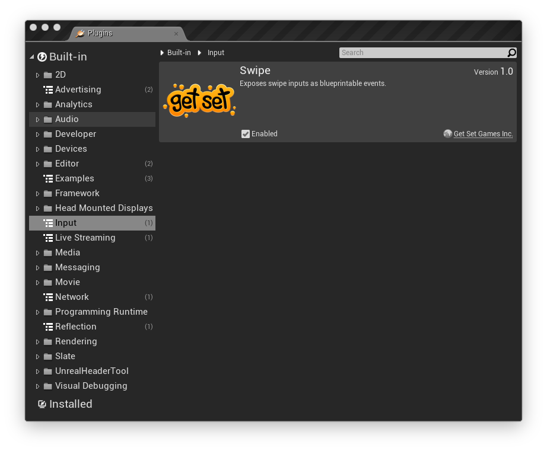
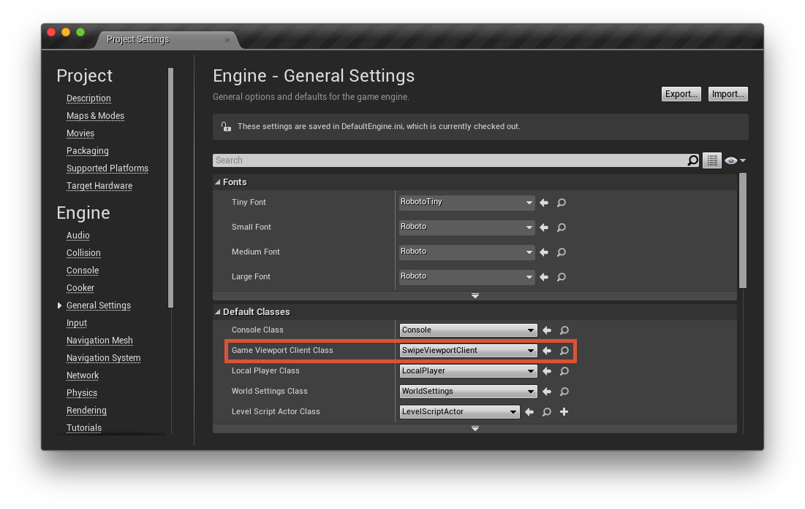
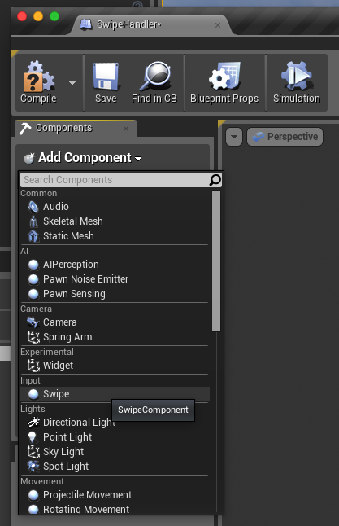
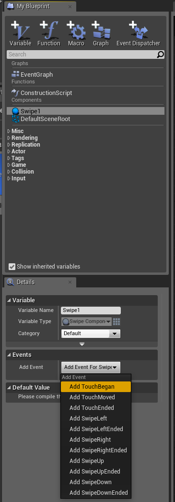
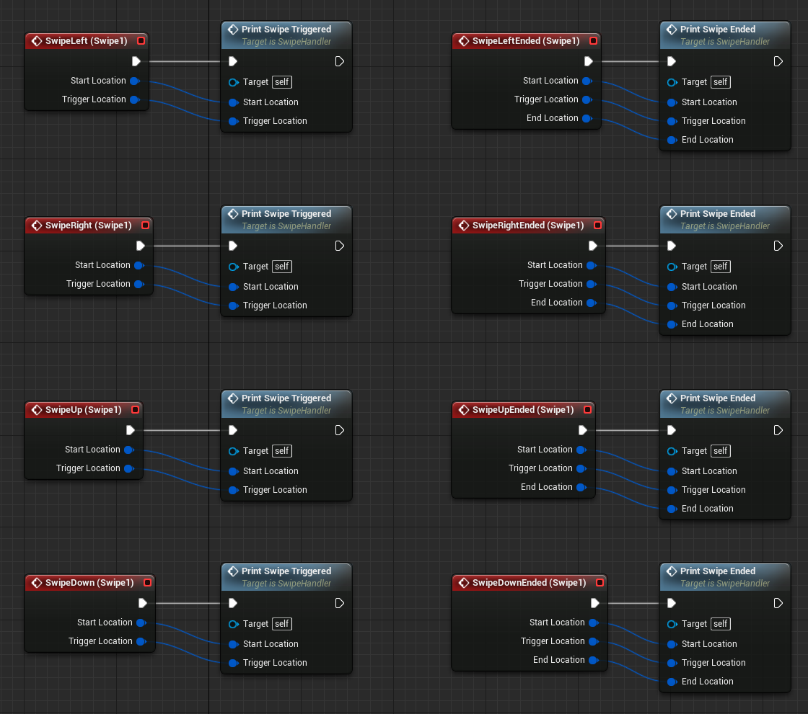
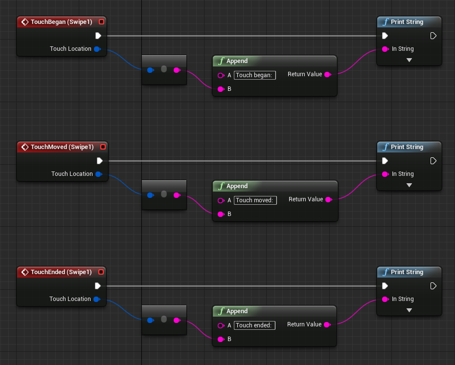
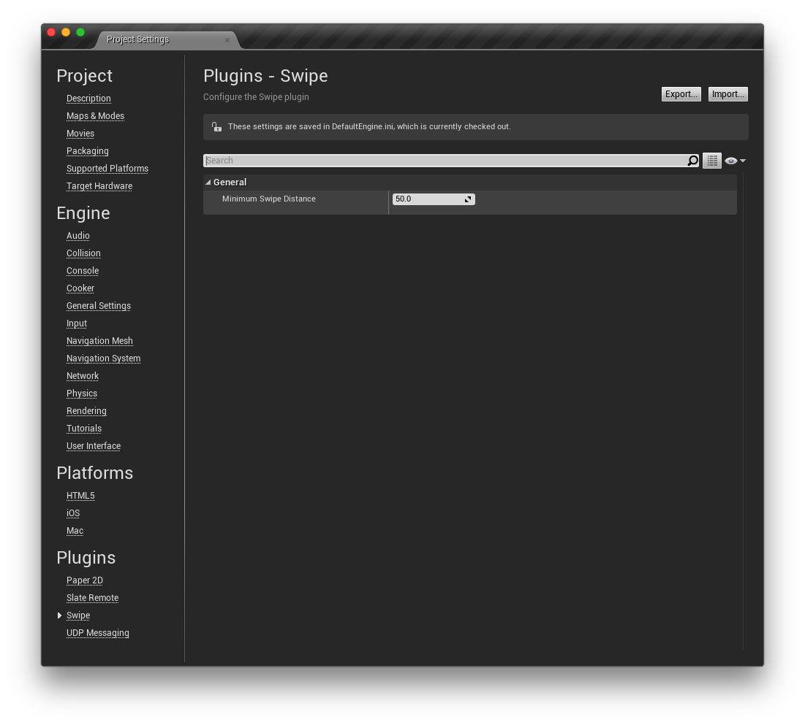

# Swipe

A plugin for Unreal Engine 4 that exposes touches and swipes on mobile devices as events in blueprints. This allows you to respond to swipes on a touchscreen as if they were buttons being pressed.

## Setup

### 1. Integration

There are a couple of different ways to integrate this plugin into your project. You can include it in your fork of the UE4 engine or you can include it in a single UE4 code-based project if you like.

#### In your engine

This method includes the plugin in your fork of the UE4 engine. It allows you to use the plugin in either code or blueprint-based projects that are created with your fork of the engine. It assumes you have already cloned the UE4 engine to a directory on your machine.

1. Clone this repo to a subfolder of your engine called /Engine/Plugins/Swipe folder. Optionally, you can add it as a submodule.
2. Run the GenerateProjectFiles script in the Engine root.
3. Open your engine project file and build the editor.

#### In your code project

This method includes the plugin in a single code-based project. This can be done on any code-based project that is created using the Github source engine or the one provided by Epic via the launcher.

1. Clone this repo to a subfolder in your project called /Plugins/Swipe.
2. Open your project. You will be prompted to build missing modules.
3. Select Yes to rebuild now.

### 2. Enable the Plugin

Ensure that the plugin is enabled:

1. In the editor, select Plugins from the Window menu.
2. Search for the plugin called Swipe. It's in the Input category.
3. Check the Enabled checkbox on the plugin. You may have to restart the editor after this step.

### 3. Set Your Game Viewport Client Class

This plugin includes a subclass of the UGameViewportClient class called USwipeViewportClient which you will need to use as your project's Game Viewport Client Class. Do this by going to Project Settings > Engine > General Settings. In the Default Classes section, you will see an option called Game Viewport Client Class. Select SwipeViewportClient, like so:

### 4. Add the Swipe Component to an Actor

Add a component called Swipe to any Actor blueprint that you would like to receive swipe input events.

### 5. Add Events to the Graph

With the component selected, you can add touch and swipe events to the graph from it's detail pane.

### 6. Respond to the Events in the Graph

Now that the events are in the graph, you can respond to them like so:

### 7. Adjust Swipe Sensitivity

You can adjust how sensitive swipe events are in your Project Settings. Navigate to Project Settings > Plugins > Swipe and modify the Minimum Swipe Distance setting to your liking.

